# Lesson 0 - Getting started with Playwright

## Objective

In this lesson, you will use Visual Studio Code to install Playwright and run your first simple test. You will also explore basic Playwright configuration, including how to work with different browsers, and review the output and reports generated by Playwright.

By the end of this exercise you will have:

- The Playwright extension for Visual Studio Code is installed and ready to use
- Your first test has been run using the VS Code extension
- A test results report has been reviewed
- Basic Playwright configuration has been adjusted


## Before we start

### Visual Studio Code

For this lesson, we will use Visual Studio Code. If you do not have Visual Studio Code installed yet, you can download it from [code.visualstudio.com](https://code.visualstudio.com/)

### Repo 

Go to the DevOps organization (pp-bootcamp-[name]) and the project  you created (PowerPlatformALM) in DevOps in preparation for this lab.

Go to Repositories.

Choose `Create a new repository`.

Give the repository the name `Playwright`.

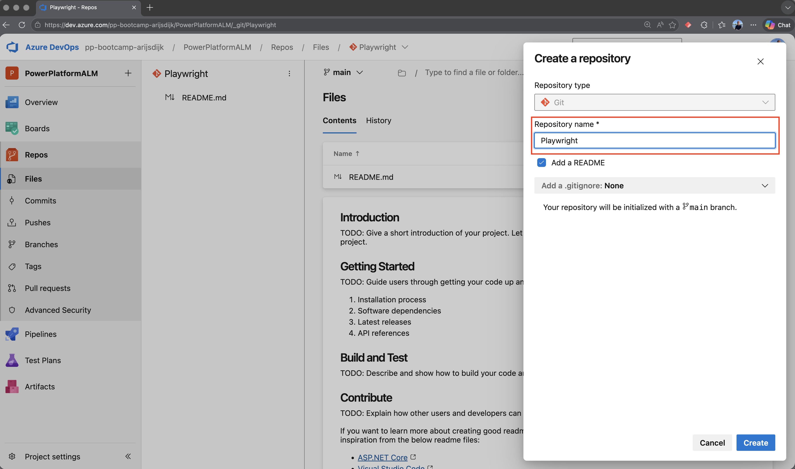

After the repository has been created, choose the `Clone in VS Code` option under Clone.

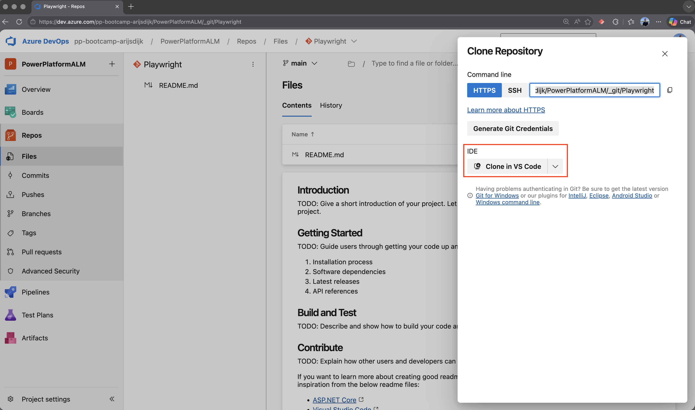


## Step 1 - Install Playwright extension

1. Go to Extensions

2. Search for Playwright

3. Select Playwright Test for VS Code and click Install

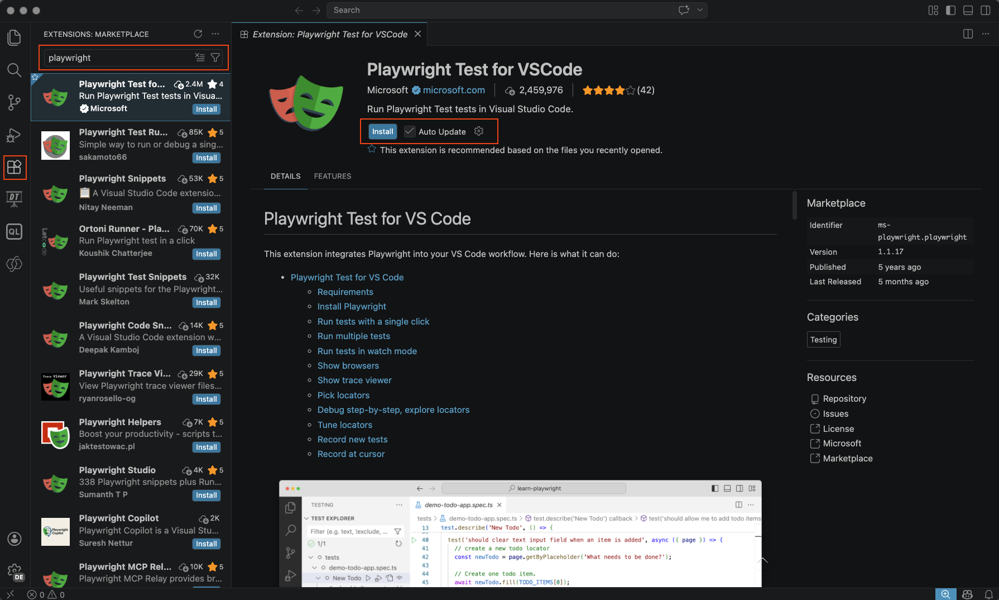


## Step 2 - Install Playwright

Now that the extension is installed, we are going to install the latest version of Playwright.

Open the terminal and run the following command:

```bash
npm init playwright@latest
```

You will now be asked a number of questions.

1. Choose TypeScript.

2. Choose a location for your end-to-end tests. For now, use the default `/tests` location.

3. Set `Add GitHub Actions` to `true`.

4. Set `Install Playwright browsers` to `true`.

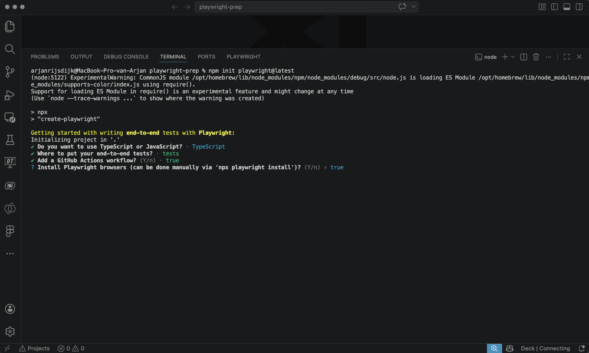

Playwright is now installed, and you will also see an included test in the folder structure.

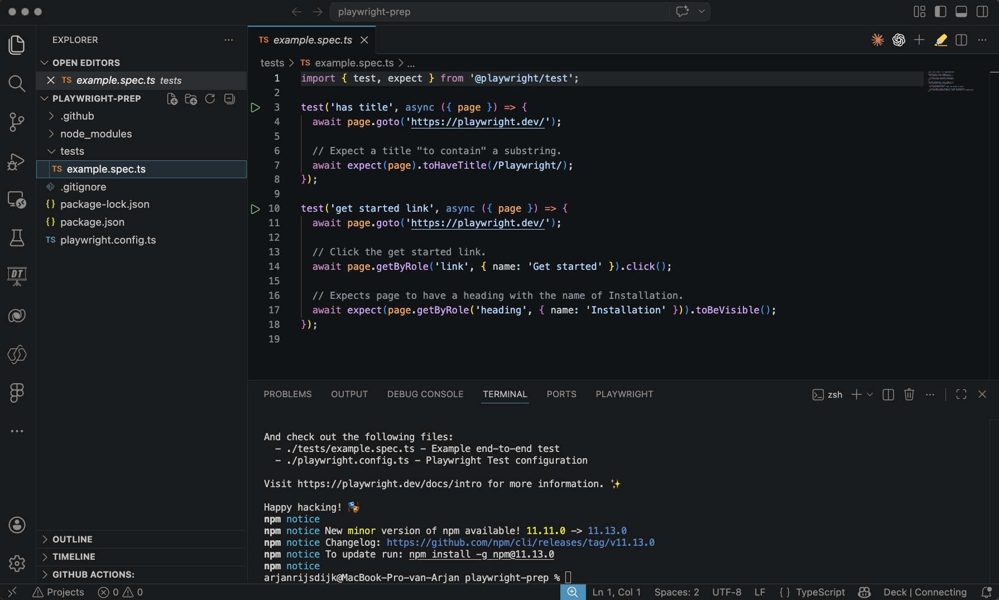


## Step 3 - Run a test

When Playwright is installed, a basic test is included as well. This test is related to the Playwright website. In this step, we will use this test to get familiar with Playwright in combination with the VS Code extension.

There are several ways to run a test:

1. Direct from spec.ts file
2. Playwright extension
3. UI mode
4. Command line 


### 1. Run from spec.ts file

Go to your `/tests` folder and click the file `example.spec.ts` so that it opens in your editor.

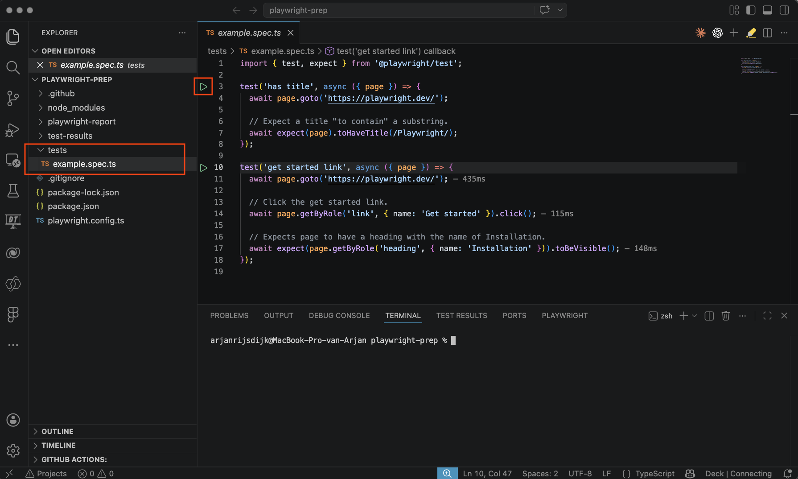

This file now contains two tests. Each test has a green Play icon. Clicking this icon will run the test. A browser will open automatically, and the steps in the test will be executed.

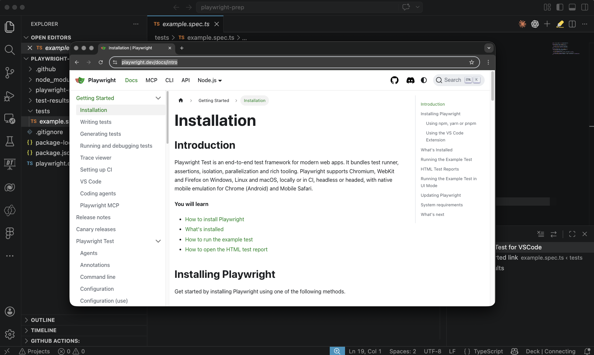


### 2. Run from Playwright extension

Open the Playwright extension in VS Code.

Click `tests`.

Click `run tests`.

Click `example.spec.ts`.

In this case, all tests defined in `example.spec.ts` will run one after another.

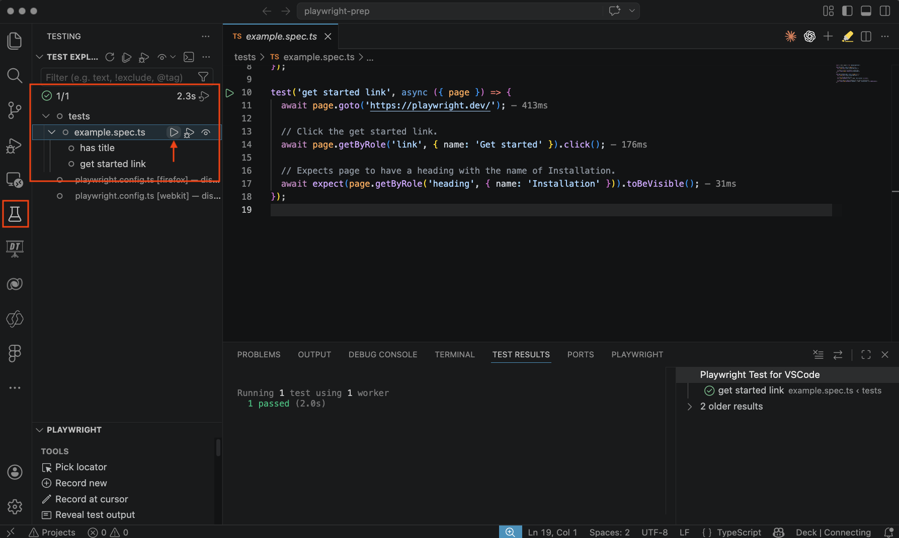


### 3. UI Mode

Playwright includes a UI mode that allows you to run tests. UI mode gives you direct insight into the tested steps, and lets you follow and analyze them.

The Playwright extension does not yet have a button to start UI mode, so we need to use the following command in the terminal:

```bash
npx playwright test --ui
```

After you run this command, UI mode will open in a new window. In this app, you can run, follow, and analyze your test within a visual interface.

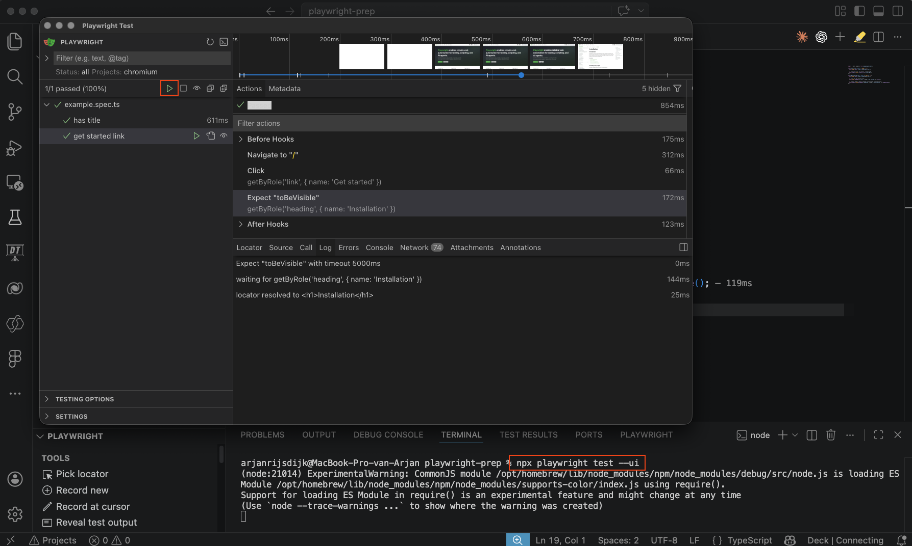


### 4. Command line

Another way to start a test is by running a command directly in the terminal.

Open the terminal and run the following command:

```bash
npx playwright test
```

What you will notice is that these tests run completely **headless**. No browser will be opened. Instead, the test runs entirely in the background, and the result is shown in your terminal.


If you want to follow the test in the browser, you can add the `--headed` option to the command.

```bash 
npx playwright test --headed
```

The commands above will run all tests you have generated at once. You can also run a specific test from the terminal.

Open your terminal and run the following command:

```bash
npx playwright test -g "get started link"
```

This runs only the test with the title `get started link`.

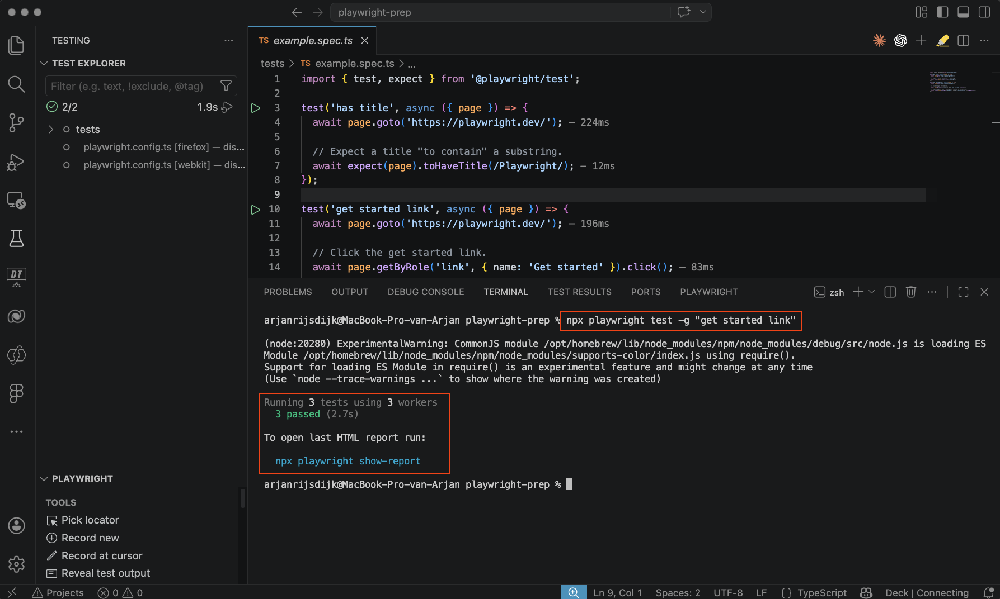


## Step 4 - View HTML report

After Playwright has run tests, whether that is a single test, multiple tests, or all tests, it will generate an HTML report with the test results in the background.

A direct link to this report is always available after running tests in your terminal. You can also open the report again at any time during the session.

To open the report, follow these steps:

Open your terminal

Run the following command

```bash
npx playwright show-report
```

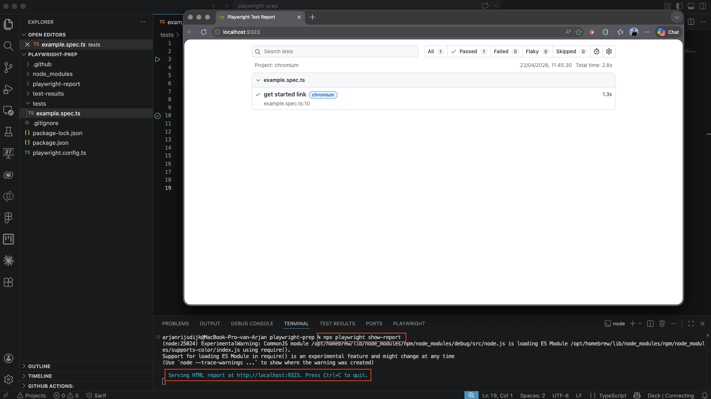


## Step 5 - Playwright configuration


## Summary

In this lesson, you installed the Playwright extension for Visual Studio Code and set up Playwright in your project. You learned several ways to run tests, including from the test file, through the Playwright extension, in UI mode, and from the command line. You also saw how to run tests in headed and headless mode, how to run a single test, and how to open the HTML report to review test results.


## Reference Links

- [Playwright - Getting started with VSCode](https://playwright.dev/docs/getting-started-vscode)
- [Playwright - Running tests](https://playwright.dev/docs/running-tests)


