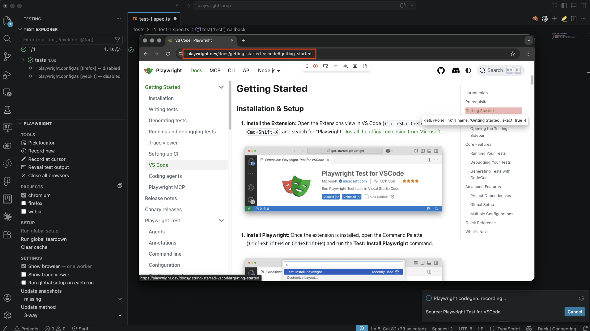
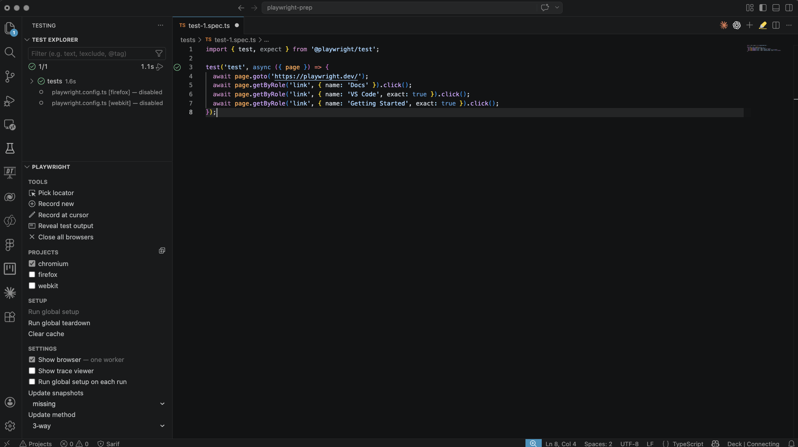
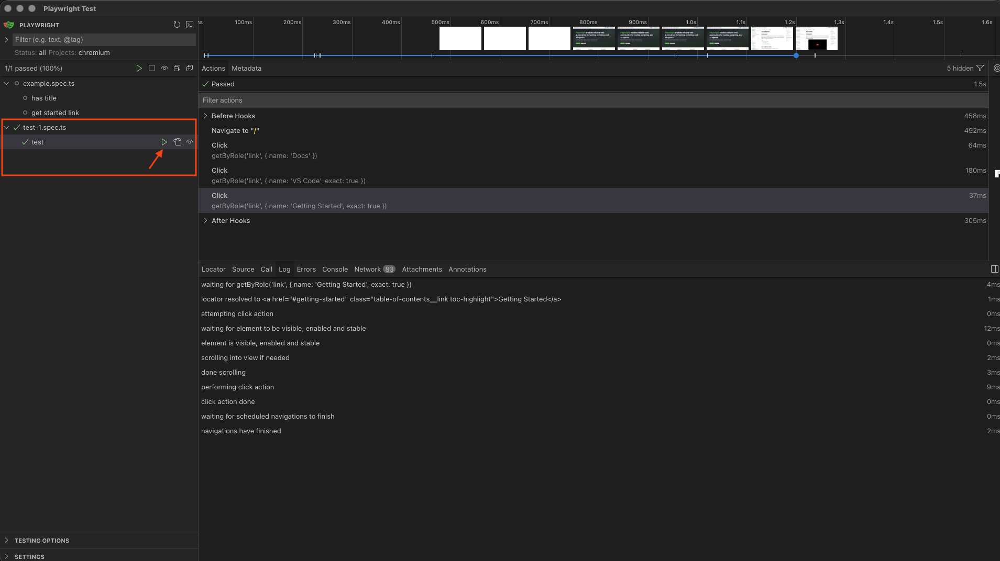

# Lesson 1 - Manage tests

## Objective


## Step 1 - Record a new test

There are several ways to create a test in Playwright. You can write a test manually in TypeScript or JavaScript, or you can use the recorder, better known as `codegen`, to create a test.

In this step, we will use the `codegen` functionality to generate a new test.

We will create a test that opens the Playwright website, navigates to the VS Code section, and then goes to Getting Started.

Open VS Code.

Open the Playwright extension.

Click `Record new`.


A blank browser window will now open in `record` mode.

Go to the `playwright.dev` website.

Click `Docs`.

Under `Getting Started`, click `VS Code`.

In the menu on the right-hand side, click `Getting Started`.



Stop the recording in the Playwright menu visible in the browser.


As a result of this new recording, a new test file named `test-1.spec.ts` has been generated.

As you can see in this file, your recording has been converted into a TypeScript test, with each action included as a separate line in the script.




## Step 2 - Run your new test

In the previous lesson, you learned how to run a test. This can be done in several ways.

Run the test you just created in UI mode.

Open your terminal and run the following command:

```bash
npx playwright test --ui
```

Go to the test you just created and click `run`.




## Step 3 - Make changes to your test

- TypeScript
- Record at cursor


## Step 4 - Aria snapshot


## Step 5 - View HTML report


## Summary

You now have:

## Reference Links

- [link](website)

