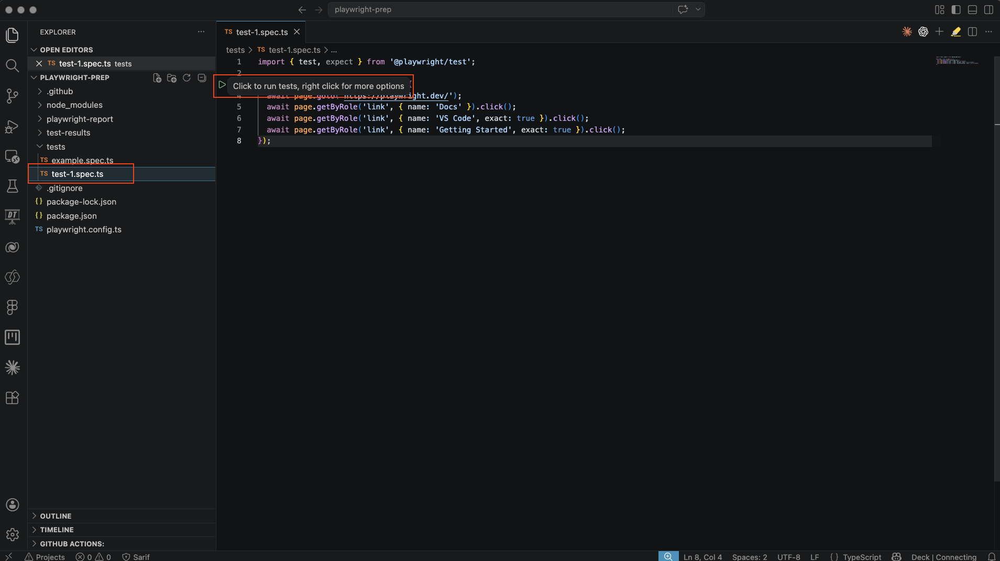
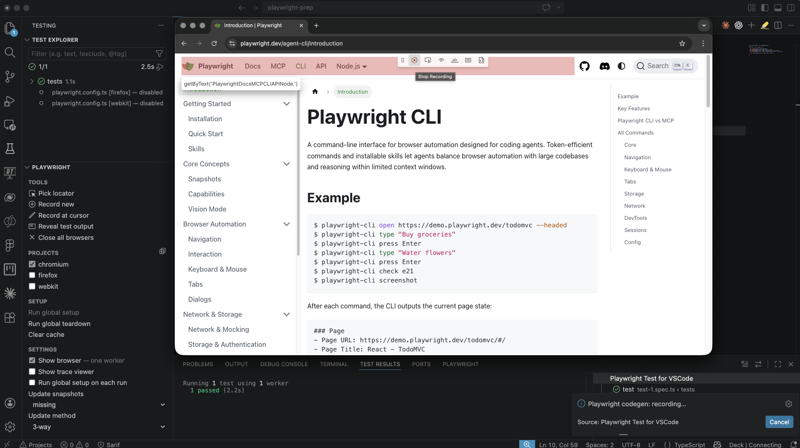
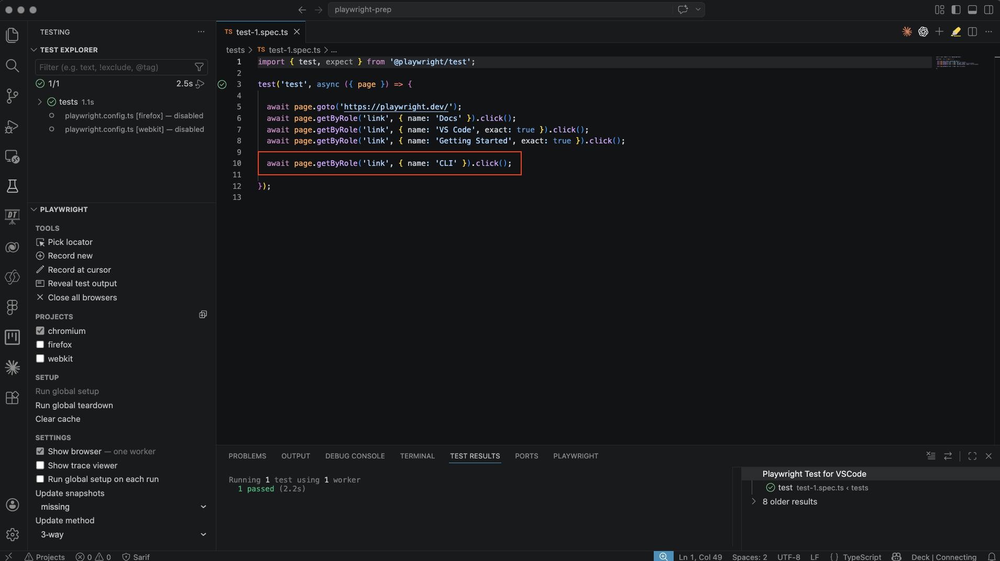
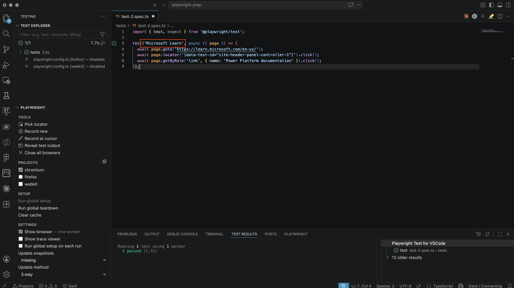
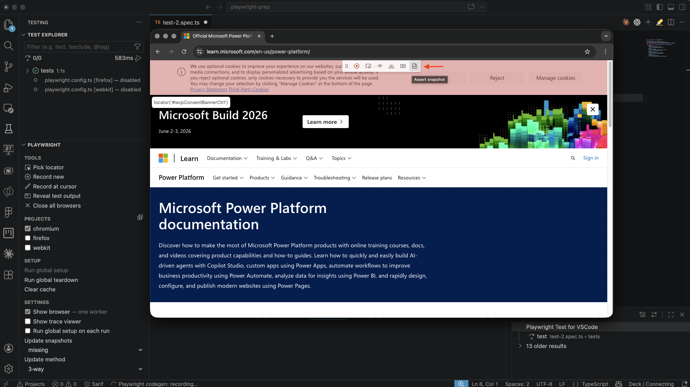
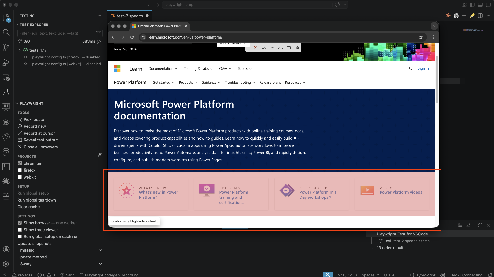
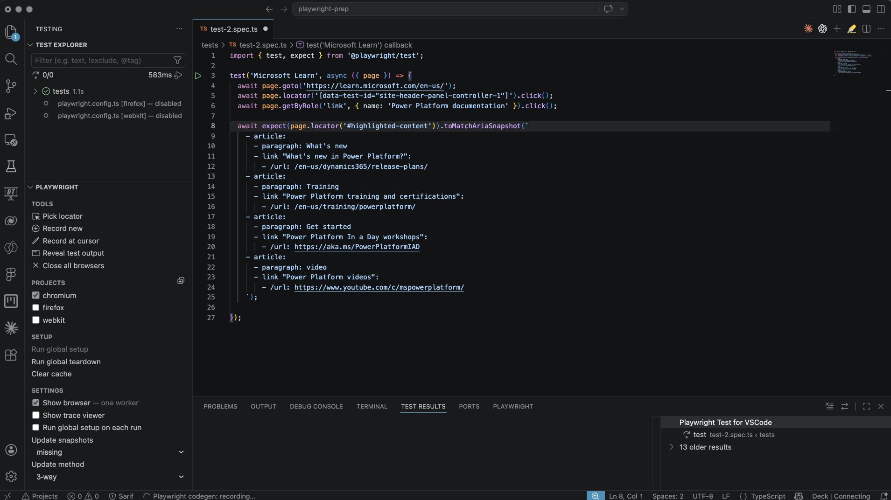

# Lesson 1 - Manage tests

## Objective

In this lesson, you will learn how to create, run, and update Playwright tests by using the Visual Studio Code extension and the `codegen` recorder. You will also explore how assertions and `aria snapshots` can be used to validate page content, and how to review successful and failed test runs in the Playwright HTML report.


## Step 1 - Record a new test

There are several ways to create a test in Playwright. You can write a test manually in TypeScript or JavaScript, or you can use the recorder, better known as `codegen`, to create a test.

In this step, we will use the `codegen` functionality to generate a new test.

We will create a test that opens the Playwright website, navigates to the VS Code section, and then goes to Getting Started.

Open VS Code.

Open the Playwright extension.

Click `Record new`.


A blank browser window will now open in `record` mode.

Go to the `playwright.dev` website.

Click `Docs`.

Under `Getting Started`, click `VS Code`.

In the menu on the right-hand side, click `Getting Started`.


Stop the recording in the Playwright menu visible in the browser.


As a result of this new recording, a new test file named `test-1.spec.ts` has been generated.

As you can see in this file, your recording has been converted into a TypeScript test, with each action included as a separate line in the script.


## Step 2 - Run your new test

In the previous lesson, you learned how to run a test. This can be done in several ways.

Run the test you just created in UI mode.

Open your terminal and run the following command:

```bash
npx playwright test --ui
```

Go to the test you just created and click `run`.


## Step 3 - Make changes to your test

After a test has been created, you may want to change it or extend it. This can also be done in different ways. You can make changes directly in the `spec.ts` file by writing TypeScript, but you can also use the `codegen` functionality to make changes.

In this step, we will further extend the test from Step 2. Follow these steps:

Open the newly generated test named `test-1.spec.ts` in your editor.

Click the `play` icon to run the test



When the test has finished, keep the browser open

Go to the Playwright extension and click `Record at cursor`


All steps you take now will be added to the test in `test-1.spec.ts`

In this example, we click `CLI` at the top of the page so that this navigation is added to the test.

Stop the recording



As you can see, the test script has now been extended with a new step




## Step 4 - Snapshot testing

Within Playwright, three things are very important for creating a good test:

- Goto
- Locators
- Assertions

These are all functions that Playwright needs to run a test. `goto` defines the URL where the test will run. Locators are the elements that need to be found, such as a button, link, heading, or text, and in addition, assertions can be added to the test.

In that sense, Playwright works very simply: there are two outcomes, true or false. If a URL or locator, for example the `CLI` link from the previous test, cannot be found, the test will return false, which means the test will fail.

### Assertion

An assertion is a piece of code in which you can add logic and ask Playwright to evaluate whether the outcome is true or false.

For example, you can evaluate whether a certain piece of text is available in a field or locator.

```bash
await expect(locator).toContainText('some text');
```

You can also reverse the example above by adding `not`.

```bash
await expect(locator).not.toContainText('some text');
```

You can find more information about using assertions on the [Playwright website](https://playwright.dev/docs/test-assertions#auto-retrying-assertions).


### Aria Snapshot

One of the most commonly used and very useful assertions in Playwright is the `toMatchAriaSnapshot` assertion.

The advantage of using an Aria snapshot is that you do not have to define many separate elements in your test. You can easily create a snapshot while recording your test. When the test runs, Playwright compares the full snapshot with the situation in the browser, and if there are differences, the test will fail.

See below for an example of a snapshot:

```bash
await page.goto('https://playwright.dev/');
await expect(page.getByRole('banner')).toMatchAriaSnapshot(`
  - banner:
    - heading /Playwright enables reliable end-to-end/ [level=1]
    - link "Get started":
      - /url: /docs/intro
    - link "Star microsoft/playwright on GitHub":
      - /url: https://github.com/microsoft/playwright
    - link /[\\d]+k\\+ stargazers on GitHub/
`);
```


### Create a Aria Snapshot

In this step, we are going to create a new test, once again using the `codegen` functionality. In this example, we go to the `learn.microsoft.com` website and then navigate to the `Power Platform documentation`. On this page, we create a snapshot that we then add to our test.

Follow these steps:

Open VS Code.

Start the Playwright extension.

Click `Record new`.

When the browser opens, enter the following address: `learn.microsoft.com`.

Click `Documentation` and then `Power Platform documentation`.

Now change the name of the test to `Microsoft Learn` so that we can easily recognize it later.

Your test will now look like this:



Run the `Microsoft Learn` test and then choose `Record at cursor` to make changes.

Now click the `Assert snapshot` button.



Move your cursor over the page and look for the locator named `#highlighted-content`. Then click this element.



After completing this action, your test will look approximately like this:




We have now created a new test with an `aria snapshot`. In the next step, we will run the test. We will also take a look at what happens when a test fails.


## Step 5 - Run test

Open your most recently created test in the editor view.

Run the test by clicking the play icon in the editor view.

View the report using the following command:

```bash
npx playwright show-report
```

In the report, you will see that the test has been executed successfully.

Now go back to the same test in your editor.

Change the following line:

```
- paragraph: What's new
```

to:

```
- paragraph: What's newwwww
```

Your test will now look like this


Run the test once again.

View the report (again) using the following command

```bash
npx playwright show-report
```


## Summary

In this lesson, you learned how to create and manage Playwright tests using the VS Code extension and `codegen`. You recorded a new test, ran it in UI mode, and extended it by adding extra recorded steps. You also explored snapshot testing, including assertions and `aria snapshots`, and created a new test that uses an `aria snapshot` to validate page content. Finally, you ran the test, reviewed the HTML report, and saw how changing expected content can cause a test to fail.


## Reference Links

- [Playwright - Generating tests](https://playwright.dev/docs/codegen-intro)
- [Playwright - Snapshot testing](https://playwright.dev/docs/aria-snapshots)

