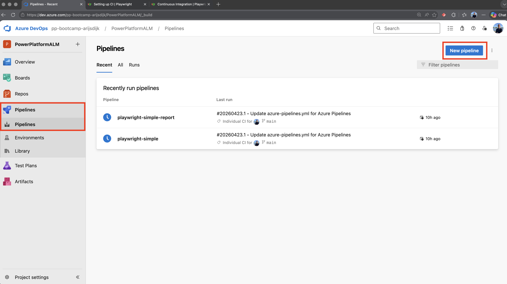
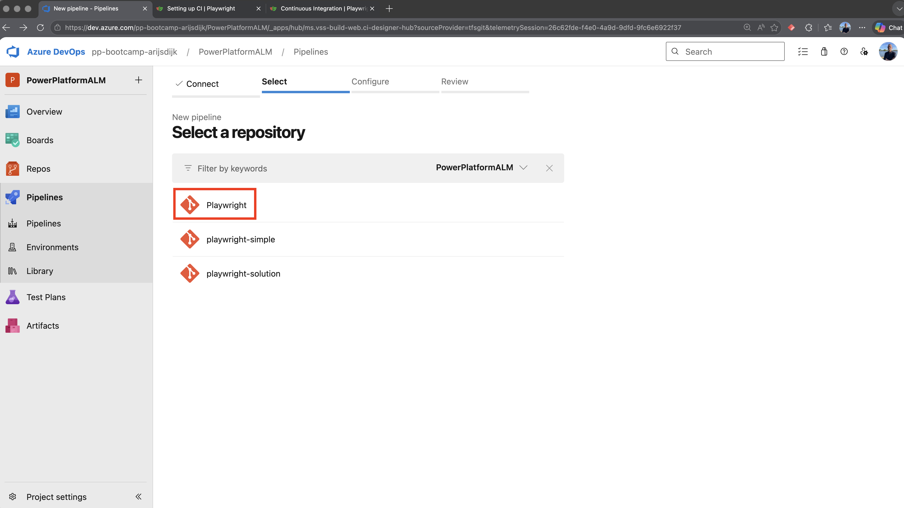
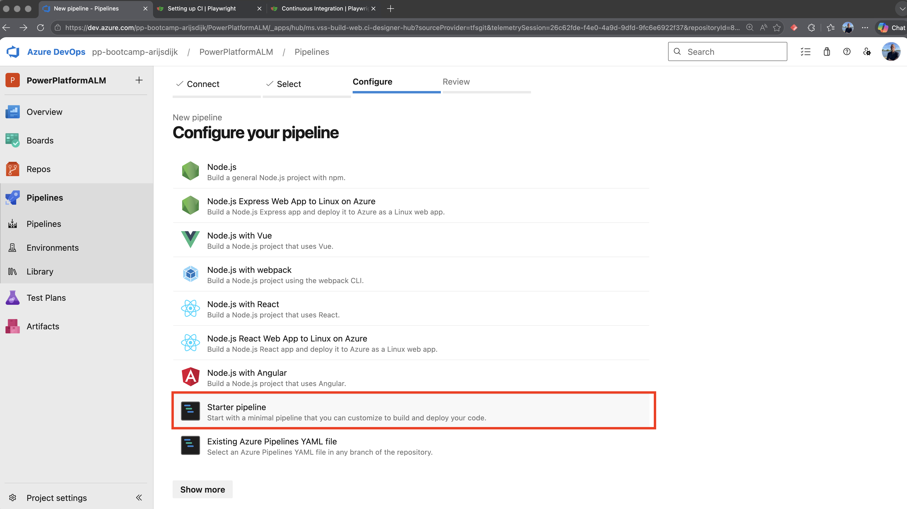
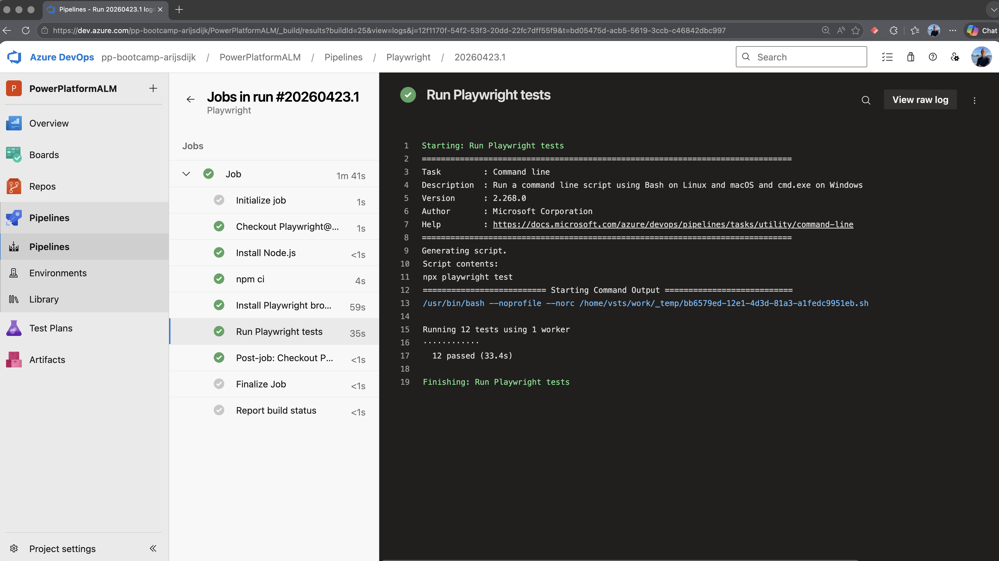
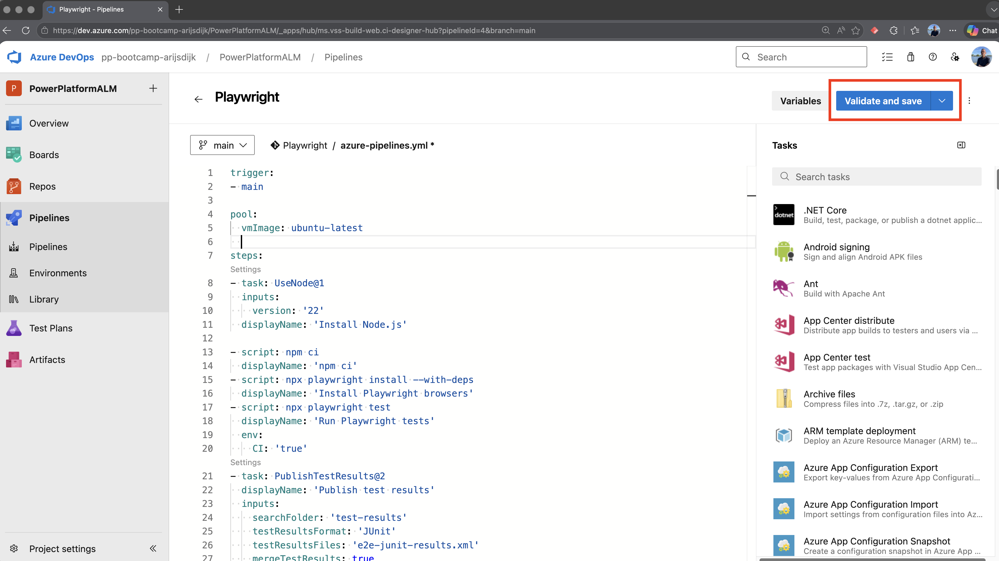
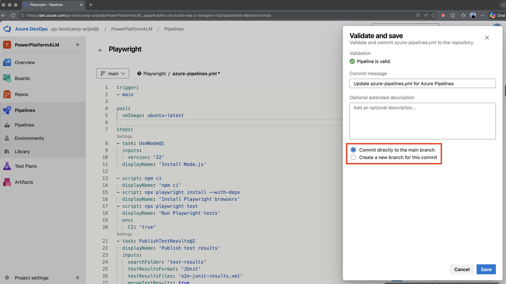
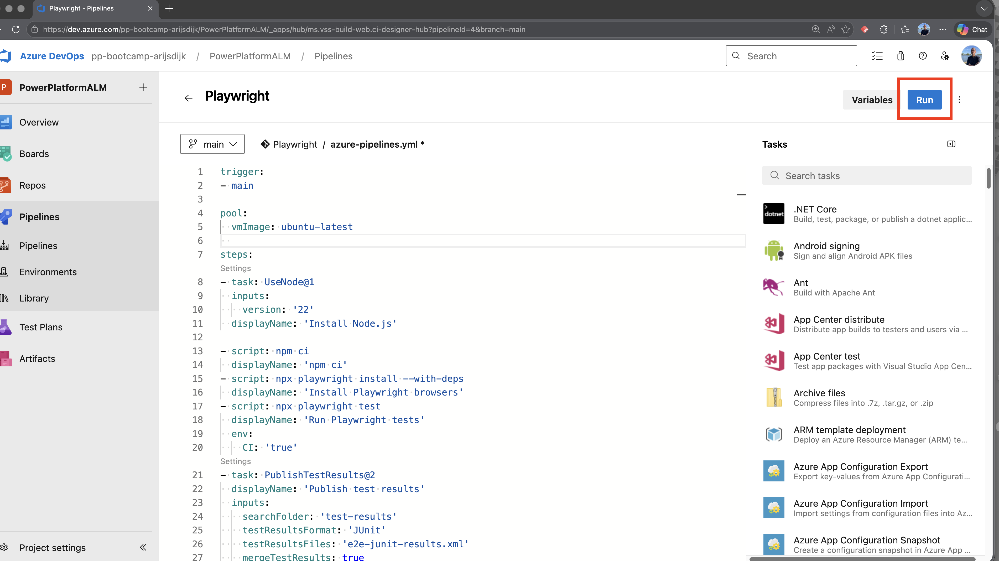
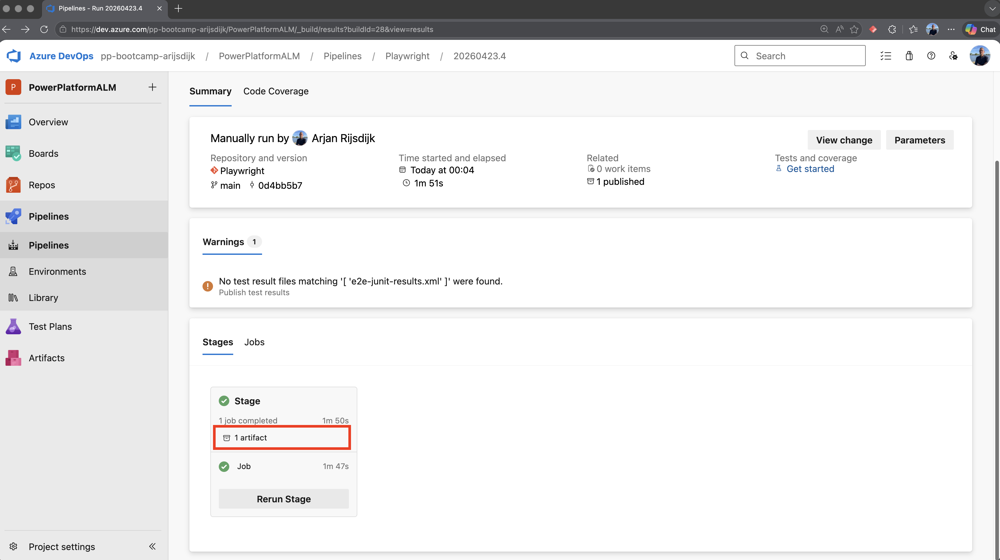
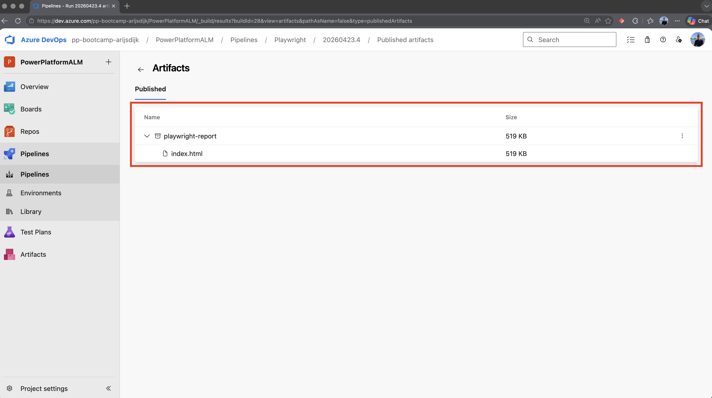
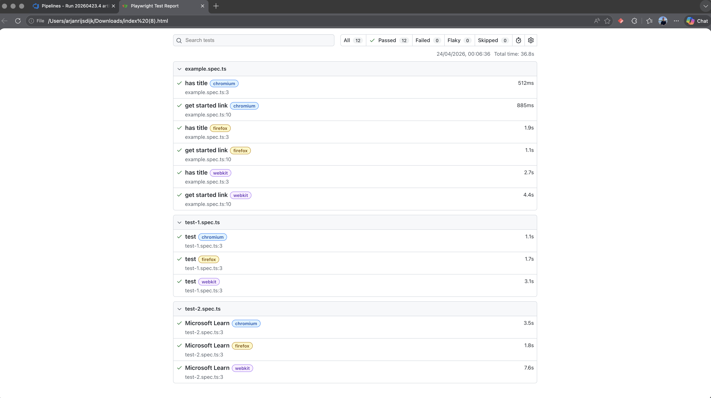

# Lesson 3 - Playwright in your pipeline

## Objective

In this lesson, you will learn how to run Playwright tests in an Azure DevOps pipeline. You will create a pipeline for your Playwright repository, configure it to execute the tests, and then extend it to publish test results and the Playwright HTML report as pipeline artifacts.


## Step 1 - Create a new pipeline

Go to the DevOps organization (pp-bootcamp-[name]) and the project you created (PowerPlatformALM) in DevOps in preparation for this lab.

Click `Pipelines`.

Then choose `New pipeline`.



Choose `Azure Repos Git`.



Select the repository named `Playwright` that you created in Lesson 0 of this lab.

Choose the `Starter pipeline` option.



Now copy the code below into the YAML editor.

```yaml
trigger:
- main

pool:
  vmImage: ubuntu-latest

steps:
- task: UseNode@1
  inputs:
    version: '22'
  displayName: 'Install Node.js'
- script: npm ci
  displayName: 'npm ci'
- script: npx playwright install --with-deps
  displayName: 'Install Playwright browsers'
- script: npx playwright test
  displayName: 'Run Playwright tests'
  env:
    CI: 'true'
```

Or, if you want to use your PAT, you can use the code below.

```yaml
trigger:
- main

pool:
  name: BootcampAgentPool

steps:
- task: UseNode@1
  inputs:
    version: '22'
  displayName: 'Install Node.js'
- script: npm ci
  displayName: 'npm ci'
- script: npx playwright install --with-deps
  displayName: 'Install Playwright browsers'
- script: npx playwright test
  displayName: 'Run Playwright tests'
  env:
    CI: 'true'
```

Now click Save and run.

Check the result in the pipeline job(s).




## Step 2 - Add report

We have now automated the Playwright tests in a pipeline. Of course, after running a test, we also want to have a report with the results available.

We can adjust the pipeline so that a report is generated and added to the pipeline as an artifact.

Open the newly created pipeline.

Click `Edit`.

Replace the YAML code with the following code.

```yaml
trigger:
- main

pool:
  vmImage: ubuntu-latest

steps:
- task: UseNode@1
  inputs:
    version: '22'
  displayName: 'Install Node.js'

- script: npm ci
  displayName: 'npm ci'
- script: npx playwright install --with-deps
  displayName: 'Install Playwright browsers'
- script: npx playwright test
  displayName: 'Run Playwright tests'
  env:
    CI: 'true'
- task: PublishTestResults@2
  displayName: 'Publish test results'
  inputs:
    searchFolder: 'test-results'
    testResultsFormat: 'JUnit'
    testResultsFiles: 'e2e-junit-results.xml'
    mergeTestResults: true
    failTaskOnFailedTests: true
    testRunTitle: 'My End-To-End Tests'
  condition: succeededOrFailed()
- task: PublishPipelineArtifact@1
  inputs:
    targetPath: playwright-report
    artifact: playwright-report
    publishLocation: 'pipeline'
  condition: succeededOrFailed()
```

If you are using a PAT, as explained in earlier labs, make sure the node pool is changed as follows:

```yaml
pool:
  name: BootcampAgentPool
```

Now click `Validate and save`.



Do not forget to choose `Commit directly to the main branch`.



Now click Run to execute the pipeline.



After the pipeline has run, a report is available as an artifact. You can find it in the stage of the executed pipeline.



Click the `Artifact` and then `Playwright-report` on the next screen.



Now click `index.html`. This file will then be downloaded, after which you can open it.




## Summary

In this lesson, you created an Azure DevOps pipeline to run Playwright tests from your repository. You configured the pipeline with the required Node.js and Playwright steps, ran it, and reviewed the results in the pipeline jobs. You then updated the pipeline to publish test results and the Playwright HTML report as artifacts, and learned how to download and open the generated report after the pipeline run.


## Reference Links

- [Playwright in Azure Pipelines](https://playwright.dev/docs/ci#azure-pipelines)


